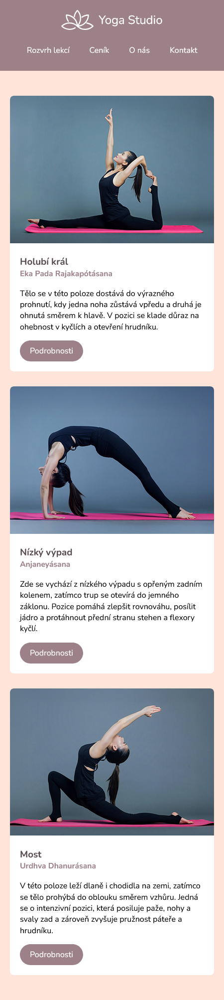

# Projekt: Yoga Studio

*Řešení cvičného projektu pro kurz HTML a CSS (blended)*

Tentokrát je tvým úkolem nakódovat **responzivní** stránku:

- Mobilní verzi máš v CSS nakódovanou, takže základní vzhled stránky máš hotový.
- Pokud jsi odvážná CSS hrdinka, můžeš si vybrat prázdné CSS a zkusit si podle obrázku nakódovat i mobilní verzi. Je to ale hlavně cvičení na responzivitu, takže si nejdřív procvič hlavně ji.
- V základu kódujeme pouze **2 verze**:
  * **Mobilní** - ta už je hotová
  * **Desktop** - na tuto verzi se stránka mění, pokud je viewport široký **1000px** nebo víc

## Mobilní verze

- V hlavičce je logo a menu pod sebou a je mezi nimi mezera `20px`. Horizontálně jsou oba prvky vycentrované.
- Karty s jógovými pozicemi jsou pod sebou a je mezi nimi mezera `20px`.

## Desktopová verze

- Logo a menu jsou v hlavičce vedle sebe, logo úplně napravo, menu úplně nalevo. Vertikálně jsou vycentrované k sobě navzájem.
- karty s jógovými pozicemi jsou vedle sebe a je mezi nimi mezera `30px`.

## BONUS

- Pokud máš vše hotové, zkus sama vymyslet, jak by mohly vypadat karty s jógovými pozicemi na tabletu - breakpoint `700px`.
- Mobilní verze karet už je na tak široký viewport příliš velká (karta přes celou obrazovku a jsou pod sebou).
- Na desktopovou  verzi (karty vedle sebe) ještě nemáme dost místa.
- Napadne tě nějaké zajímavé řešení? Zrealizuj ho v CSS.

## Ukázka responzivního chování

Podívej se na video ve *ukazka-responzivniho-chovani.mp4* ve složce s projektem.

## Ukázka výsledku - MOBIL

## Ukázka výsledku - DESKTOP

